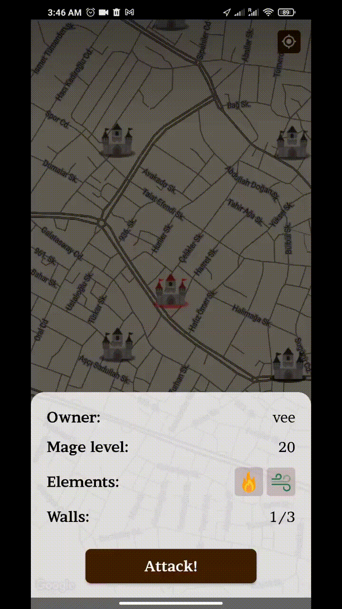

    

# Enchanted Towers
## Java Project | Higher School of Economics, 2023

Read this in other languages: [English](./README.md), [Русский](./README.ru.md)

See presentation (ru) [here](https://docs.google.com/presentation/d/1EUZ_jMGauI1In_pn11sZEyMh0hu_vtjz4ywV4bDZ51w/edit?usp=sharing)

## Authors:
- [Vladislav Artiukhov](https://github.com/Vladislav0Art)
- [Vladislav Naumkin](https://github.com/dezd4r)
- [Dmitrii Artiukhov](https://github.com/dmitrii-artuhov)

## Words of gratitude:

On behalf of our entire team, we would like to say huge thanks to [Vitaly Selishchev](https://github.com/vvselischev), our mentor, for his invaluable contribution to the project. In addition to the main duties of the mentor, Vitaly held online meetings for us, where he helped us solve problems that we encountered as we developed, Vitaly also conducted an online code review, where he pointed out our mistakes and suggested possible alternatives for writing code that would facilitate the development process for us. And even that's not all: at almost every online meeting, Vitaly showed us various OOP patterns and methods for solving classical problems related to the creation of project architecture.

## Description of the project:

Enchanted Towers is a medieval fantasy mobile game in which players compete by capturing and holding towers on a real map while casting spells on their smartphone screen or on real paper.

There are markers (towers) on the map, players must live to get to the towers in order to be able to capture them and subsequently set their defensive spells. Tower owners can thwart attackers from anywhere in the world by taking a picture of one of the available defensive spells with a unique effect on paper.

### Core mechanics:

**Enchantments and spells, improving the mage's skills:**

The mage, having a certain set of spells (patterns), forms an enchantment on the canvass, then this enchantment is installed on the tower defense wall.

**Attacker:**

The attacker must guess the enchantment based on the list of elements used when enchanting this wall. The attacker must repeat the enchantment by drawing it with `>= N%` overlap with what is set on the wall of defense. The attacker must be in close proximity to the tower to begin its capture.

**Defender:**

The defender to defend the tower during the attack can draw a special pattern on a piece of paper that will respond to a special defensive spell, then he loads it through the camera into our game. The pattern is matched to the defensive spell, and if the match is `>= N%` correct, it triggers, and some action is performed on the attacking mages:

1. Inverting the canvas to draw on the X-axis
2. Inverting the canvas for drawing on the Y axis
3. Phone vibration

**Towers:**

A tower can have multiple walls of defense. To capture it, you must destroy all defense walls one at a time.

## Game components:

- Registration / authorization
- Tower capture and defense session
- Session for installing enchantments on the walls of the tower
- Recognition of the contours of spells and substitution for existing templates
- Use the camera to capture pictures in high quality
- Image processing and contour selection
- Special effects of defensive spells: invert attacker's canvases vertically, horizontally and enable vibration on their devices.

## Used technologies:

| Technology | Description |
|------------|-------------|
| Android SDK | Game client + UI |
| gRPC | Network communication |
| Google Map API | Maps functionality |
| PostgreSQL | Database |
| JBcrypt | Passwords hashing (related to authentication service) |
| Hibernate | Database ORM |

## Screenshots and videos:

### Gameplay record using defensive spells (image recognition via camera):

[Enchanted Towers - gameplay footage](https://drive.google.com/file/d/1r4isSCaLmbLplhZf8eS9OvL7gWaWBl1V/view?usp=sharing)

### **Tower attack**: observer on the left, attacker on the right

    
    

### **Protection wall installation**:

    

## Dependencies:

- PostgreSQL
- GRPC
- OpenCV (quickbirds)
- jts
- Google Maps API
- Hibernate ORM
- JWT

## Local build:

1. `git clone https://github.com/Giga-Chad-LLC/Enchanted-Towers.git`
2. Building proto-models:
     - Run task: `gradle :common:utils:build`
     - And then: `gradle :common:utils:SyncProtobufFiles :common:utils:SyncProtoGrpcDependencies`
     - Delete folder `/common/build/generated/source`
     - When rebuilding models, you must manually delete the previous folder with generated files
3. Run the docker database image: `cd /docker && docker-compose up`
4. After that, the clients (target: `client.app`) are launched first, then the server (target: `server`)

