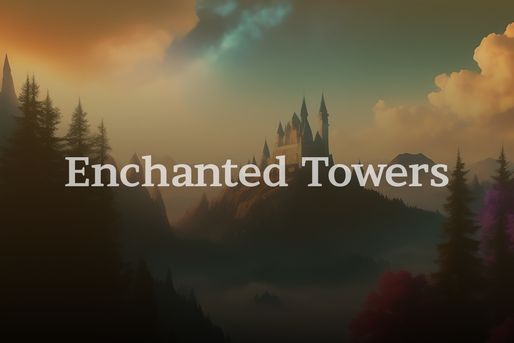

    

# Enchanted Towers
## Java Проект | Высшая Школа Экономики, 2023

Read this in other languages: [English](./README.md), [Русский](./README.ru.md)

## Участники проекта:

- [Артюхов Владислав](https://github.com/Vladislav0Art)
- [Артюхов Дмитрий](https://github.com/dmitrii-artuhov)
- [Наумкин Владислав](https://github.com/dezd4r)

## Слова благодарности:

От лица всей нашей команды хотим сказать огромное спасибо [Виталию Селищеву](https://github.com/vvselischev), нашему ментору, за его неоценимый вклад в проект. Помимо основных обязанностей ментора Виталий проводил для нас долнительные онлайн-встречи, где помогал решать проблемы, с которыми мы сталкивались по мере разработки, также Виталий проводил code-review, на котором указывал на наши ошибки и предлагал возможные альтернативы по написанию кода, которые бы облегчили нам процесс разработки. И даже это еще не все: практически на каждой онлайн-встрече Виталий показывал нам различные паттерны ООП и методы решения классических проблем, связанных с созданием архитектуры проектов.

## Описание проекта:

Enchanted Towers — мобильная игра в жанре средневекового фэнтези, в которой игроки должны соревноваться, захватывая и удерживая башни на реальной карте, колдуя заклинания на экране своего смартфона или на настоящей бумаге.

На карте расположены метки (башни), игроки должны вживую добираться до башен, чтобы иметь возможность захватить их и впоследствии устновить свои защитные заклинания. Владельцы башен могут из любой точки мира воспрепятствовать атакующим, сфотографировав рисунок одного из трез доступных защитных заклинаний с уникальным эффектом на бумаге.

### Описание механик:

**Чары и заклинания, совершенствование навыков мага:**

Маг, имея определенный набор чар (узоров), формирует из чар заклинание на канвасе, далее данное заклинание устанавливается на стену защиты башни.

**Атакующий:**

Атакующий должен угадать заклинание на основе списка используемых при зачаровании данной стены стихий. Атакующий должен повторить заклинание, нарисовав его с `>= N%` совпадением с тем, что установлено на стене защиты. Атакующий должен быть в непостедственной близости к башне, чтобы начать ее захват.

**Обороняющийся:**

Обороняющийся для защиты башни во время атаки может нарисовать на листе бумаги специальный узор, который будет отвечать специальному оборонительному заклинанию, далее он загружает его через камеру в нашу игру. Узор сопостовляется с  оборонительным заклинанием, и если сопоставление корректно на `>= N%`, то оно срабатывает, и исполняется какое-то действие над атакующими магами:

1. Инвертирование холста для рисования по оси X
2. Инвертирование холста для рисования по оси Y
3. Вибрация телефона

**Башни:**

Башня может иметь несколько стен защиты. Чтобы ее захватить необходимо уничтожить все стены защиты по очереди.

## Компоненты игры:

- Регистрация/авторизация
- Сессия захвата и обороны башни
- Сессия установки заклинаний на стены башни
- Распознавание контуров заклинаний и подстановка на имеющиеся темплейты
- Использование камеры для захвата картинки в высоком качестве
- Обработка изображения и выделение контуров
- Специальные эффекты оборонительных заклинаний: инверсия канвасов атакующий по верткали, горизонтали и включение вибрации на их устройствах.

## Использованные технологии:

| Технология | Описание |
|------------|-------------|
| Android SDK | Клиент игры + UI |
| gRPC | Сетевое взаимодействие |
| Google Map API | Карта |
| PostgreSQL | База данных |
| JBcrypt | Хэширование паролей (связано с сервисом авторизации) |
| Hibernate | ORM для базы данных |
| OpenCV (quickbirds) | Распознование изображений |

## Выполненные задачи:

### Владислав Артюхов:

1. Настройка сборки проекта и зависимостей
1. Разработка UI игры
1. Сервис по созданию защитных заклинаний
1. Сервис атаки защитных стен
1. Сервис наблюдения за атакующим башни
1. Авторизация, регистрация и интерсепторы запросов

### Дмитрий Артюхов:

1. Функционал взаимодействия на холсте
1. Pattern matching: поиск узора, похожего на нарисованный
1. Сервис атаки защитных стен
1. Сервис наблюдения за атакующими башни
1. Image recognition: получение и предобработка фотографии
1. Сервис установки противодействующих заклинаний
1. Книга заклинаний: отрисовка

### Владислав Наумкин:

1. Подключение Google Maps API обработка взаимодействий
1. Запрос и обработка прав на геолокацию
1. Отрисовка башен и игрока на карте и обработка событий клика
1. Запрос координат башен при старте карты
1. Подключение Hibernate и базы данных
1. Авторизация и регистрация
1. Интерсепторы запросов для передачи токена игровой сессии

## Скриншоты и видео:

### Запись игры с использованием оборонительных заклинаний (распознавание изображения через камеру):

**Youtube-видео с геймплеем (начать на картинку):**

[Enchanted Towers - запись геймплея](https://drive.google.com/file/d/1r4isSCaLmbLplhZf8eS9OvL7gWaWBl1V/view?usp=sharing)

### **Атака на башню**: слева наблюдатель, справа - атакующий

    
    

### **Установка защитной стены**:

    

### **Использование распознования изображений**:

    

## Зависимости:

- PostgreSQL
- GRPC
- OpenCV (quickbirds)
- jts
- Google Maps API
- Hibernate ORM
- JWT

## Локальная сборка:

1. `git clone https://github.com/Giga-Chad-LLC/Enchanted-Towers.git`
2. Сборка proto-моделей:
    - Запустить задачу: `gradle :common:utils:build`
    - А затем: `gradle :common:utils:SyncProtobufFiles :common:utils:SyncProtoGrpcDependencies`
    - Удалить папку `/common/build/generated/source`
    - При повторной пересборке моделей необходимо вручную удалить предыдщую папку со сгенерированными файлами
3. Запустить докер-образ базы данных: `cd /docker && docker-compose up`
4. После чего вначале запускаются клиенты (target: `client.app`), затем сервер (taget: `server`)