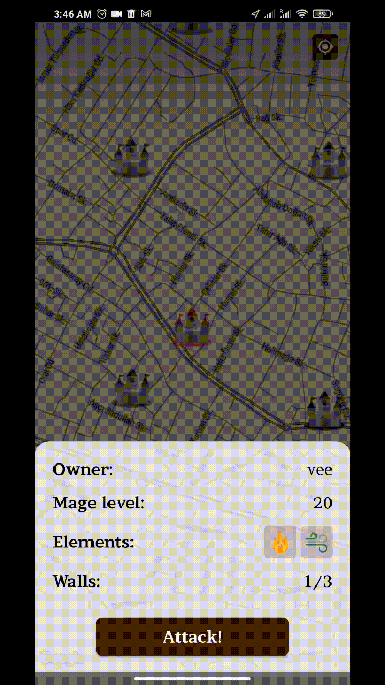

    

# Enchanted Towers
## Java Проект | Высшая Школа Экономики, 2023

Read this in other languages: [English](./README.md), [Русский](./README.ru.md)

## Участники проекта:

- [Артюхов Владислав](https://github.com/Vladislav0Art)
- [Артюхов Дмитрий](https://github.com/dmitrii-artuhov)
- [Наумкин Владислав](https://github.com/dezd4r)

## Слова благодарности:

От лица всей нашей команды хотим сказать огромное спасибо [Виталию Селищеву](https://github.com/vvselischev), нашему ментору, за его неоценимый вклад в проект. Помимо основных обязанностей ментора Виталий проводил для нас долнительные онлайн-встречи, где помогал решать проблемы, с которыми мы сталкивались по мере разработки, также Виталий проводил code-review, на котором указывал на наши ошибки и предлагал возможные альтернативы по написанию кода, которые бы облегчили нам процесс разработки. И даже это еще не все: практически на каждой онлайн-встрече Виталий показывал нам различные паттерны ООП и методы решения классических проблем, связанных с созданием архитектуры проектов.

## Описание проекта:

Enchanted Towers — мобильная игра в жанре средневекового фэнтези, в которой игроки должны соревноваться, захватывая и удерживая башни на реальной карте, колдуя заклинания на экране своего смартфона или на настоящей бумаге.

На карте расположены метки (башни), игроки должны вживую добираться до башен, чтобы иметь возможность захватить их и впоследствии устновить свои защитные заклинания. Владельцы башен могут из любой точки мира воспрепятствовать атакующим, сфотографировав рисунок одного из трез доступных защитных заклинаний с уникальным эффектом на бумаге.

## Компоненты игры:

- Регистрация/авторизация
- Сессия захвата и обороны башни
- Сессия для установке укреплений на стены башни
- Распознавание контуров заклинаний и подстановка на имеющиеся темплейты
- Использование камеры для захвата картинки в высоком качестве
- Обработка изображения и выделение контуров
- Специальные эффекты оборонительных заклинаний: инверсия канвасов атакующий по верткали, горизонтали и включение вибрации на их устройствах.

## Скриншоты и видео:

### Запись игры с использованием оборонительных заклинаний (распознавание изображения через камеру):

[Enchanted Towers - запись геймплея](https://drive.google.com/file/d/1r4isSCaLmbLplhZf8eS9OvL7gWaWBl1V/view?usp=sharing)

### **Атака на башню**: слева наблюдатель, справа - атакующий

    
    

### **Установка защитной стены**:

    

## Зависимости:

- PostgreSQL
- GRPC
- OpenCV (quickbirds)
- jts
- Google Maps API
- Hibernate ORM
- JWT

## Локальная сборка:

1. `git clone https://github.com/Giga-Chad-LLC/Enchanted-Towers.git`
2. Сборка proto-моделей:
    - Запустить задачу: `gradle :common:utils:build`
    - А затем: `gradle :common:utils:SyncProtobufFiles :common:utils:SyncProtoGrpcDependencies`
    - Удалить папку `/common/build/generated/source`
    - При повторной пересборке моделей необходимо вручную удалить предыдщую папку со сгенерированными файлами
3. Запустить докер-образ базы данных: `cd /docker && docker-compose up`
4. После чего вначале запускаются клиенты (target: `client.app`), затем сервер (taget: `server`)